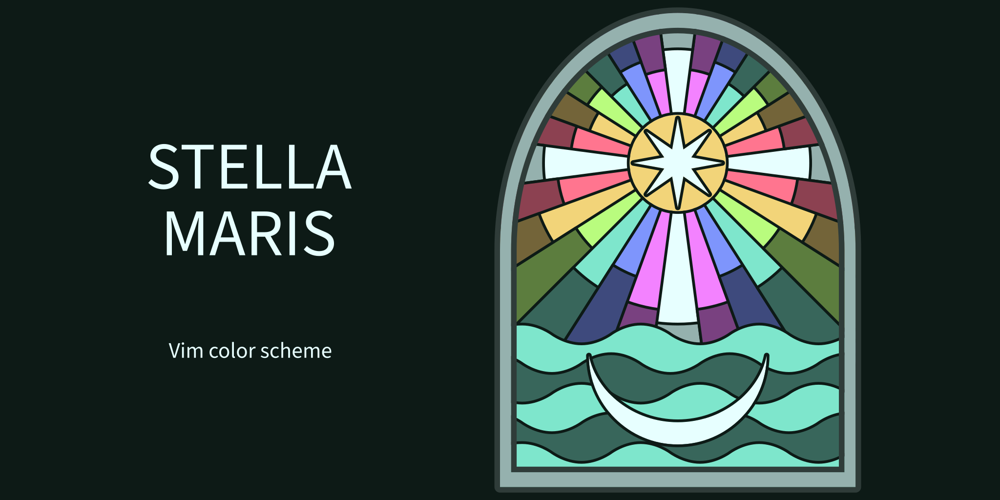

# Stella Maris: Vim color scheme

[Project home](https://sr.ht/~johnridesabike/vim-stella-maris/) |
[Git repository](https://git.sr.ht/~johnridesabike/vim-stella-maris) |
[Mailing list](https://lists.sr.ht/~johnridesabike/public-inbox)

Stella Maris is my ([John's][0]) personal Vim color scheme. It:

- uses sixteen colors that map to the usual terminal colors.
- works with GUI colors, base-256 colors, base-16 colors, and monochrome. I
  mostly use the GUI colors.
- includes a dark and a light version. I mostly use the dark one.
- is accessible to my eyes, and also according to Colortemplate's stats.
- defines the usual highlight groups that Vim's built-in themes do.
- does not include any special support for third-party plugins.
- supports transparent backgrounds.
- is built with the [Vim Colortemplate tool][1].
- is under the same license as Vim.
- looks like this:

## Installation and usage

You can get Stella Maris by using Git to [clone its repository here][2]. After
you add it to your Vim configuration (using your favorite package management
tool), you can load it with `:colo[rscheme] stella`.

Send any patches to <~johnridesabike/public-inbox@lists.sr.ht>

## License

Copyright © John Jackson. Distributed under the same terms as Vim itself. See
`:help license`.

[0]: https://johnridesa.bike/
[1]: https://github.com/lifepillar/vim-colortemplate
[2]: https://git.sr.ht/~johnridesabike/vim-stella-maris
