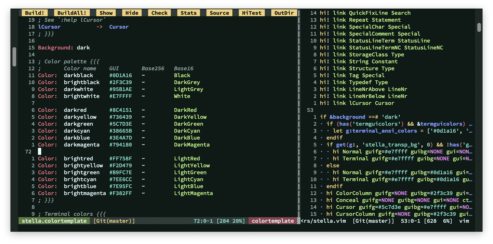

# Stella Maris: Vim color scheme

Stella Maris is my personal Vim color scheme. It:

- uses sixteen colors that map to the usual terminal colors.
- works with GUI colors, base-256 colors, base-16 colors, and monochrome. I
  mostly use the GUI colors.
- includes a dark and a light version. I mostly use the dark one.
- is accessible to my eyes, and also according to Colortemplate's stats.
- defines the usual highlight groups that Vim's built-in themes do.
- does not include any special support for third-party plugins.
- supports transparent backgrounds.
- is built with the [Vim Colortemplate tool][0].
- is licensed under the same license as Vim.

[0]: https://github.com/lifepillar/vim-colortemplate

Feel free to use it if you like it! Add it to your Vim configuration and select
it with `:colo[rscheme] stella`.
